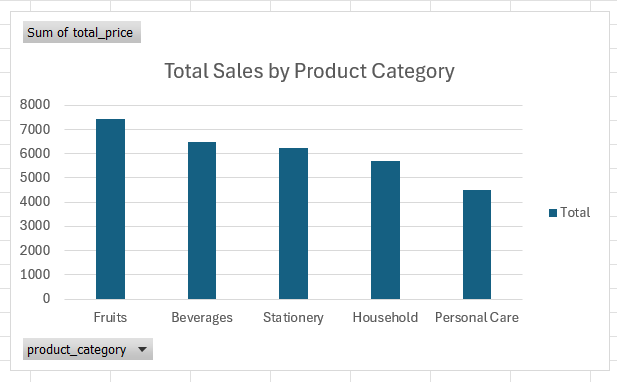
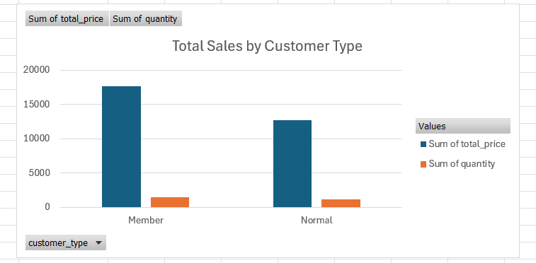

# MIS 311 Individual Assignment: Supermarket Sales Analysis

## 1. Project Overview
This project analyzes a supermarket sales dataset to understand sales performance across product categories and customer types. The analysis was conducted using Microsoft Excel, including data cleaning, descriptive statistics, PivotTables, PivotCharts, and data visualizations.
The main purpose of this project is to apply Exploratory Data Analysis (EDA) to identify useful business insights from sales data.

## 2. Dataset Description
The dataset contains supermarket sales records. Each row represents one sales transaction.
The original dataset contained 253 rows and 8 columns. After checking and cleaning the data, the final dataset used for analysis contained 239 valid rows.
The dataset includes the following variables:
- sale_id: Unique identifier for each sale
- branch: Branch of the supermarket
- city: City where the supermarket is located
- customer_type: Type of customer
- product_name: Name of the product
- product_category: Category of the product
- quantity: Number of units sold
- total_price: Total sales amount in USD
In this dataset, the total_price variable represents the sales amount in USD, so it was used as the main measure of sales revenue in the analysis.

## 3. Data Cleaning 
The dataset was checked for missing values and duplicate rows before analysis.
First, missing values were reviewed across all columns. The dataset had missing values in customer_type, product_category, and quantity. Since these columns are important for analyzing customer behavior, product performance, and sales volume, rows with missing values were removed to improve data completeness and reliability.
Second, duplicate rows were checked using the Remove Duplicates function in Excel. Three duplicate rows were identified and removed. This step helps avoid counting the same transaction more than once.
After cleaning, the dataset was ready for descriptive analysis and visualization.

## 4. Descriptive Statistics
Descriptive statistics were generated using the Data Analysis ToolPak in Microsoft Excel. The analysis focused on two numerical variables: quantity and total_price.
For quantity, the total quantity sold was 2,576 units, with an average of approximately 10.78 units per transaction. The minimum quantity sold in one transaction was 1 unit, while the maximum quantity sold was 20 units.
For total_price, the total sales revenue was USD 30,362.94, with an average sales value of approximately USD 127.04 per transaction. The lowest transaction value was USD 2.18, while the highest transaction value was USD 427.14.
These descriptive statistics provide an overall understanding of supermarket sales performance and customer purchasing patterns.

## 5. Key Insights

### Insight 1: Total Sales by Product Category
The analysis shows that Fruits generated the highest total sales among all product categories, with total revenue of USD 7,450.12. This means that Fruits contributed the most strongly to supermarket revenue compared to other categories such as Beverages, Stationery, Household, and Personal Care.
This finding suggests that the supermarket should manage inventory carefully for Fruits to avoid stock shortages and maintain strong sales performance. Since this category has the highest sales contribution, it may also be useful for promotions, product placement, and demand planning.

### Insight 2: Total Sales by Customer Type
The analysis shows that Member customers generated higher total sales than Normal customers. Member customers contributed USD 17,614.08 in total sales, while Normal customers contributed USD 12,748.86.
This suggests that the membership group is valuable to the supermarket. Therefore, the business can strengthen its membership program through loyalty benefits, discounts, or personalized promotions to encourage repeat purchases and customer loyalty.

## 6. Visualizations
The project includes the following visualizations:
- Total Sales by Product Category
- Total Sales by Customer Type
These charts help present the findings clearly and make the analysis easier to understand.

### Total Sales by Product Category

### Total Sales by Customer Type

## 7. Conclusion
Overall, this project shows how basic business analytics techniques can be used to understand supermarket sales data. Through data cleaning, descriptive statistics, PivotTables, and visualizations, the analysis provides useful insights into product category performance and customer purchasing behavior. The findings suggest that Fruits are the strongest product category in terms of sales revenue, while Member customers play an important role in total supermarket sales. These insights can support better business decisions related to inventory planning, promotion strategies, and customer loyalty programs.
